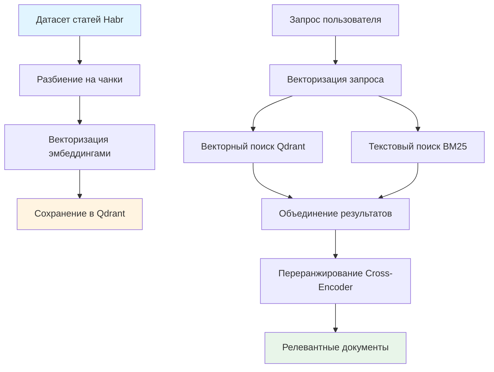
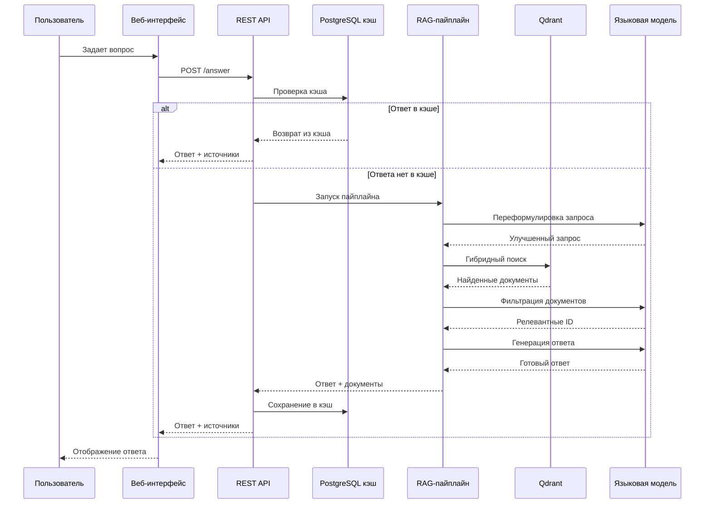

# Архитектура RAG-системы для работы с документами Habr

Система представляет собой RAG-приложение, которое отвечает на вопросы пользователей на основе статей с Habr. Когда пользователь задает вопрос, система находит релевантные фрагменты статей и использует их для генерации ответа через языковую модель.

Система состоит из нескольких основных компонентов. Веб-интерфейс принимает запросы пользователей и отправляет их в REST API. API обрабатывает запросы через RAG-пайплайн, построенный на LangGraph. Для хранения документов используется векторная база данных Qdrant, а готовые ответы кэшируются в PostgreSQL, чтобы не обрабатывать одинаковые запросы повторно.

## Архитектура пайплайна

Работа системы начинается с подготовки данных. Статьи из датасета разбиваются на небольшие фрагменты по тысяче символов с небольшим перекрытием. Это нужно для того, чтобы при поиске находились именно те части текста, которые отвечают на вопрос, а не целые статьи целиком. Каждый фрагмент сохраняет информацию об исходной статье: автора, заголовок, ссылку и другие метаданные.

Следующий шаг - векторизация. Каждый фрагмент текста преобразуется в вектор чисел с помощью модели эмбеддингов. Эти векторы сохраняются в векторной базе данных Qdrant вместе с самим текстом и метаданными. Векторы устроены так, что похожие по смыслу тексты имеют похожие векторы, что позволяет быстро находить релевантные фрагменты по запросу пользователя.

Поиск документов работает гибридно. Когда приходит запрос пользователя, он тоже преобразуется в вектор. Система ищет похожие фрагменты двумя способами: векторным поиском по базе Qdrant и текстовым поиском BM25, который хорошо находит документы по ключевым словам. Результаты обоих методов объединяются с учетом их весов. После этого найденные документы проходят через модель переранжирования, которая более точно оценивает их релевантность запросу и оставляет только самые подходящие.



## Взаимодействие компонентов

Когда пользователь задает вопрос через веб-интерфейс, запрос отправляется в REST API. API сначала проверяет, нет ли уже готового ответа в кэше. Если такой же вопрос задавали раньше, ответ возвращается сразу без запуска пайплайна. Это экономит время и ресурсы.

Если ответа в кэше нет, запускается RAG-пайплайн, построенный как граф из нескольких последовательных шагов. Сначала запрос пользователя переформулируется языковой моделью, чтобы лучше выразить намерение и найти более релевантные документы. Затем запускается поиск по векторной базе данных с использованием гибридного подхода. Найденные документы передаются в следующий шаг, где языковая модель анализирует их и выбирает наиболее релевантные фрагменты, сохраняя их идентификаторы.

На финальном этапе языковая модель генерирует ответ, опираясь на выбранные фрагменты документов. Ответ формируется так, чтобы он был информативным и основанным на найденных источниках. После генерации ответ сохраняется в кэш вместе с найденными документами, чтобы при повторном запросе не запускать весь пайплайн заново.

Пользователь получает не только ответ, но и список источников - ссылки на статьи, из которых была взята информация. При необходимости можно запросить краткую сводку по любой из статей, и система извлечет все фрагменты этой статьи из базы данных и создаст краткое резюме.

Вся система работает асинхронно, что позволяет обрабатывать несколько запросов одновременно. Для отслеживания работы системы используется Langfuse, который автоматически логирует все шаги пайплайна для последующего анализа и улучшения системы.



# Тестирование и оценка качества RAG-системы (Langfuse)

Для комплексной оценки качества работы RAG-системы используется интеграция с платформой Langfuse, которая позволяет логировать все шаги выполнения, создавать тестовые датасеты и автоматически рассчитывать метрики качества.

## Датасеты для тестирования

Для оценки системы используются синтетические датасеты, содержащие пары вопросов и ожидаемых ответов:

- **qa_dataset.jsonl**  511 примеров (вопрос, ожидаемый ответ, метаданные статьи и чанка)

Каждая запись в датасете содержит следующие поля:
- `question`  вопрос пользователя
- `answer`  ожидаемый правильный ответ
- `id`  идентификатор статьи
- `document_chunk_id`  номер чанка внутри статьи
- `global_chunk_id`  глобальный идентификатор чанка
- `url`  ссылка на оригинальную статью
- дополнительные метаданные (автор, заголовок и т.д.)

## Пайплайн тестирования

Процесс оценки системы состоит из трех последовательных этапов:

### 1. Создание датасета в Langfuse

На первом этапе тестовые данные из JSONL файла загружаются в Langfuse. Это делается с помощью скрипта `evaluation/create_langfuse_dataset.py`:

```bash
python evaluation/create_langfuse_dataset.py \
  --file-path evaluation/data/qa_dataset.jsonl \
  --dataset-name habr-rag-dataset
```

Скрипт создает датасет в Langfuse и заполняет его элементами, где каждый элемент содержит входные данные (вопрос) и ожидаемый результат (правильный ответ с метаданными).

### 2. Запуск RAG на датасете

На втором этапе RAG-система запускается на всех вопросах из датасета. Это можно сделать через FastAPI эндпоинт `/run_dataset` или через CLI скрипт `evaluation/run_dataset.py`:

```bash
python evaluation/run_dataset.py \
  --dataset-name habr-rag-dataset \
  --run-name test-run
```

В процессе выполнения:
- Каждый вопрос обрабатывается через полный RAG-пайплайн
- Все шаги (переформулировка, поиск, фильтрация, генерация) логируются в Langfuse с полными трейсами
- Для каждого вопроса сохраняется найденные документы и сгенерированный ответ

### 3. Оценка результатов

На третьем этапе производится автоматический расчет метрик качества по результатам запуска. Скрипт `evaluation/evaluate_dataset_run.py` извлекает данные из Langfuse и вычисляет метрики:

```bash
python evaluation/evaluate_dataset_run.py \
  --dataset-name habr-rag-dataset \
  --run-name test-run \
  --output evaluation/logs/report.json
```

Результаты сохраняются в JSON файл, который содержит:
- Метрики качества поиска (retrieval)
- Метрики качества генерации (generation)
- Детальную информацию по каждому примеру из датасета

## Метрики качества

Для оценки системы используются две группы метрик: метрики качества поиска (retrieval) и метрики качества генерации ответов (generation).

### Метрики качества поиска (Retrieval)

Эти метрики оценивают, насколько хорошо система находит релевантные фрагменты документов:

- **hit@k**  доля запросов, где хотя бы один релевантный чанк попал в топ-k результатов. Показывает вероятность того, что система найдет нужную информацию в первых k результатах.

- **recall@k**  средняя доля релевантных чанков, найденных в топ-k. Если для вопроса релевантно 3 чанка, и все 3 попали в топ-5, то recall@5 = 1.0 для этого примера.

- **mrr (Mean Reciprocal Rank)**  среднее значение обратного ранга первого релевантного документа. Если релевантный документ на 1-м месте, вклад = 1.0, на 2-м  0.5, на 3-м  0.33 и т.д.

- **id_based_context_recall**  доля целевых чанков (по global_chunk_id), которые система реально нашла. RAGAS метрика.

- **id_based_context_precision**  доля найденных чанков, которые действительно релевантны запросу. RAGAS метрика.

### Метрики качества генерации (Generation)

Эти метрики оценивают качество сгенерированных ответов по сравнению с ожидаемыми, а также сопосбны учитывать найденные документы, на предмет галлюцинаций со стороны LLM 

- **bertscore_f1/precision/recall**  семантическое сходство между сгенерированным и ожидаемым ответом на уровне эмбеддингов. F1-мера балансирует точность и полноту.

- **rouge1_f / rougeL_f**  n-gram схожесть (ROUGE-1 считает совпадение униграмм, ROUGE-L  наибольшую общую подпоследовательность).

- **bleu**  точное n-gram совпадение, популярная метрика из машинного перевода.

- **chrf**  посимвольная схожесть, учитывает совпадения на уровне символов.

- **similarity_scores**  косинусное сходство эмбеддингов ответов (RAGAS метрика).

- **non_llm_string_similarity**  простая текстовая схожесть без использования моделей.

## Результаты прогона (100 примеров)

Оценка проводилась на датасете **qa_dataset.jsonl**
Стоит отметить, что гиперпараметры, заданные настройками системы, вносят свои коррективы. Например, можно заметить, что **hit@2/3/5: 0.81** одинаковы. Это связано с тем, что мы указали при работе RAG использовать на выходе только два документа для ответа

**Результаты поиска (Retrieval):**

- **hit@1: 0.43**  релевантный чанк сразу на первой позиции в 43% случаев
- **hit@2/3/5: 0.81**  релевантный чанк есть в топ-2/3/5 в 81% случаев
- **recall@1: 0.43; recall@2/3/5: 0.81**  доля найденных релевантных чанков
- **mrr: 0.62**  средний ранг первого релевантного чанка
- **id_based_context_recall: 0.81**  81% целевых чанков найдено
- **id_based_context_precision: 0.405**  40.5% найденного действительно релевантно

**Результаты генерации (Generation):**

- **bertscore_f1: 0.8505** (precision: 0.8315, recall: 0.8705)  высокое семантическое совпадение
- **rouge1_f: 0.2031; rougeL_f: 0.1923**  умеренная n-gram/LCS схожесть
- **bleu: 0.0337**  низкое точное совпадение (типично для генеративных моделей)
- **chrf: 0.2497**  умеренная посимвольная схожесть
- **similarity_scores: 0.9034**  очень высокое эмбеддинг-сходство
- **non_llm_string_similarity: 0.1099**  низкая простая текстовая схожесть
- **faithfulness/factual_correctness**  не рассчитывались в данном прогоне

## Выходные данные

После прохождения всех трех этапов тестирования получаются следующие артефакты:

1. **JSON-отчет с метриками** (`evaluation/logs/*.json`)  содержит сводные метрики и детальную информацию по каждому примеру

2. **Трейсы в Langfuse UI**  полная визуализация выполнения каждого запроса с временными метками, входами/выходами каждого шага (paraphrase  retrieve  identify  generate), использованными токенами и стоимостью запросов к LLM.
