# Архитектура RAG-системы для работы с документами Habr

Система представляет собой RAG-приложение, которое отвечает на вопросы пользователей на основе статей с Habr. Когда пользователь задает вопрос, система находит релевантные фрагменты статей и использует их для генерации ответа через языковую модель.

Система состоит из нескольких основных компонентов. Веб-интерфейс принимает запросы пользователей и отправляет их в REST API. API обрабатывает запросы через RAG-пайплайн, построенный на LangGraph. Для хранения документов используется векторная база данных Qdrant, а готовые ответы кэшируются в PostgreSQL, чтобы не обрабатывать одинаковые запросы повторно.

## Архитектура пайплайна

Работа системы начинается с подготовки данных. Статьи из датасета разбиваются на небольшие фрагменты по тысяче символов с небольшим перекрытием. Это нужно для того, чтобы при поиске находились именно те части текста, которые отвечают на вопрос, а не целые статьи целиком. Каждый фрагмент сохраняет информацию об исходной статье: автора, заголовок, ссылку и другие метаданные.

Следующий шаг — векторизация. Каждый фрагмент текста преобразуется в вектор чисел с помощью модели эмбеддингов. Эти векторы сохраняются в векторной базе данных Qdrant вместе с самим текстом и метаданными. Векторы устроены так, что похожие по смыслу тексты имеют похожие векторы, что позволяет быстро находить релевантные фрагменты по запросу пользователя.

Поиск документов работает гибридно. Когда приходит запрос пользователя, он тоже преобразуется в вектор. Система ищет похожие фрагменты двумя способами: векторным поиском по базе Qdrant и текстовым поиском BM25, который хорошо находит документы по ключевым словам. Результаты обоих методов объединяются с учетом их весов. После этого найденные документы проходят через модель переранжирования, которая более точно оценивает их релевантность запросу и оставляет только самые подходящие.

```mermaid
flowchart TD
    A[Датасет статей Habr] --> B[Разбиение на чанки]
    B --> C[Векторизация эмбеддингами]
    C --> D[Сохранение в Qdrant]
    
    E[Запрос пользователя] --> F[Векторизация запроса]
    F --> G[Векторный поиск Qdrant]
    F --> H[Текстовый поиск BM25]
    G --> I[Объединение результатов]
    H --> I
    I --> J[Переранжирование Cross-Encoder]
    J --> K[Релевантные документы]
    
    style A fill:#e1f5ff
    style D fill:#fff4e1
    style K fill:#e8f5e9
```

## Взаимодействие компонентов

Когда пользователь задает вопрос через веб-интерфейс, запрос отправляется в REST API. API сначала проверяет, нет ли уже готового ответа в кэше. Если такой же вопрос задавали раньше, ответ возвращается сразу без запуска пайплайна. Это экономит время и ресурсы.

Если ответа в кэше нет, запускается RAG-пайплайн, построенный как граф из нескольких последовательных шагов. Сначала запрос пользователя переформулируется языковой моделью, чтобы лучше выразить намерение и найти более релевантные документы. Затем запускается поиск по векторной базе данных с использованием гибридного подхода. Найденные документы передаются в следующий шаг, где языковая модель анализирует их и выбирает наиболее релевантные фрагменты, сохраняя их идентификаторы.

На финальном этапе языковая модель генерирует ответ, опираясь на выбранные фрагменты документов. Ответ формируется так, чтобы он был информативным и основанным на найденных источниках. После генерации ответ сохраняется в кэш вместе с найденными документами, чтобы при повторном запросе не запускать весь пайплайн заново.

Пользователь получает не только ответ, но и список источников — ссылки на статьи, из которых была взята информация. При необходимости можно запросить краткую сводку по любой из статей, и система извлечет все фрагменты этой статьи из базы данных и создаст краткое резюме.

Вся система работает асинхронно, что позволяет обрабатывать несколько запросов одновременно. Для отслеживания работы системы используется MLflow, который автоматически логирует все шаги пайплайна для последующего анализа и улучшения системы.

